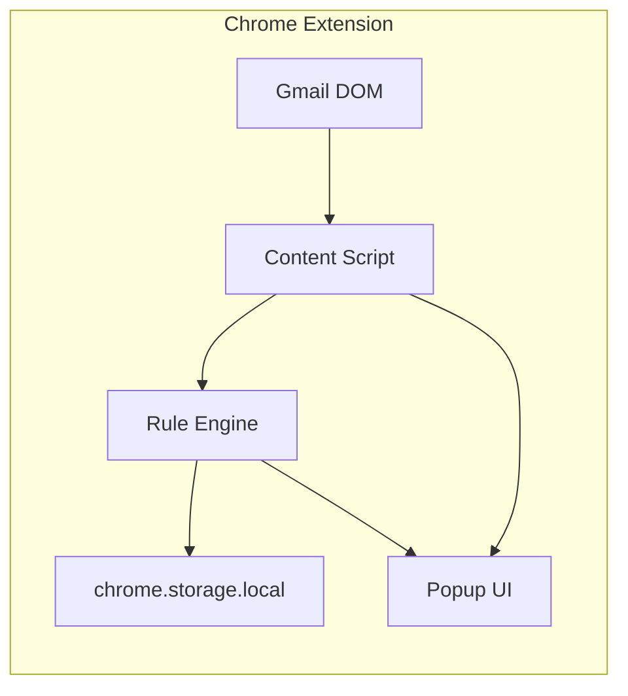

# PhishGuard

**PhishGuard** is a Chrome extension that analyzes open Gmail messages for phishing indicators using a local, explainable rule engine. All analysis runs in your browser — no email content is sent to external servers.

> **Resume one-liner:** Built a Chrome extension that analyzes Gmail messages locally using 10+ heuristic rules and URL checks, scoring phishing risk with explainable factors (100% recall on a labeled test set of 20 synthetic emails).

## Threat model

| Aspect | Detail |
|--------|--------|
| **Threat** | Phishing emails that trick users into clicking malicious links, revealing credentials, or replying to impersonated senders |
| **User** | College students and general Gmail users reviewing suspicious messages |
| **Trust boundary** | Email content is read from the Gmail DOM only when the user has the message open |
| **Out of scope** | Attachment malware analysis, server-side ML, non-Gmail clients (Outlook support planned) |

## Features

- **12 heuristic detection rules** — sender mismatch, reply-to divergence, link deception, punycode domains, suspicious TLDs, urgency language, and more
- **Explainable risk score (0–100)** with per-finding evidence
- **Actionable guidance** — what to do when a message looks suspicious
- **Privacy-first** — 100% local analysis, no external API calls in the MVP
- **Badge indicator** — risk score shown on the extension icon while viewing Gmail

## Architecture



### Detection rules

1. Sender mismatch (display name vs. From address)
2. Reply-To divergence
3. Link deception (display URL ≠ href)
4. Punycode / homograph domains
5. Suspicious TLDs (.xyz, .tk, .click, etc.)
6. Urgency and credential language
7. Credential-harvesting link paths
8. Sender/link domain mismatch
9. Raw IP address links

## Getting started

### Prerequisites

- Node.js 18+
- Google Chrome

### Install and build

```bash
npm install
npm run build
```

### Load in Chrome

1. Open `chrome://extensions`
2. Enable **Developer mode**
3. Click **Load unpacked**
4. Select the `dist/` folder
5. Open [Gmail](https://mail.google.com) and click an email
6. Click the PhishGuard extension icon to view the analysis

### Run tests

```bash
npm test
npm run evaluate   # print precision/recall on the test corpus
```

The test suite includes 10 synthetic phishing samples and 10 benign samples in `tests/fixtures/`.

See [DEMO.md](DEMO.md) for a 2-minute portfolio demo script.

## Evaluation results

On the included labeled test corpus (threshold: score ≥ 50 = phishing):

| Metric | Value |
|--------|-------|
| Samples | 20 (10 phishing, 10 benign) |
| Precision | 100% |
| Recall | 100% |
| Accuracy | 100% |

*Synthetic samples are designed for rule validation, not real-world production accuracy. See Limitations below.*

## Project structure

```
src/
  analysis/       # Rule engine, link parser, scorer, guidance
  content/        # Gmail DOM extraction (content script)
  background/     # Service worker (badge updates)
  popup/          # Extension popup UI
  shared/         # Types and messaging
tests/
  fixtures/       # Labeled phishing and benign email samples
```

## Limitations

- **Gmail only** — DOM selectors may break if Google updates the Gmail UI
- **Heuristic-based** — no machine learning; sophisticated spear-phishing may evade rules
- **False positives** — marketing emails with urgency language may score medium risk
- **English-focused** — keyword rules target English phishing templates
- **No attachment scanning** — malicious PDFs/ZIPs are not analyzed
- **No threat intel APIs** — VirusTotal / Safe Browsing integration is a planned enhancement

## Ethical use

- Analyze only **your own email** or **synthetic test samples**
- Do not store or transmit other users' email content
- Use findings to educate and protect — not to harass senders
- Report real phishing to your IT team or [PhishTank](https://phishtank.org/)

See [SECURITY.md](SECURITY.md) for privacy details.

## Roadmap

- [ ] Outlook Web App support
- [ ] Optional VirusTotal / Google Safe Browsing URL checks
- [ ] User-configurable sensitivity threshold
- [ ] Export analysis report for IT submission

## License

MIT
