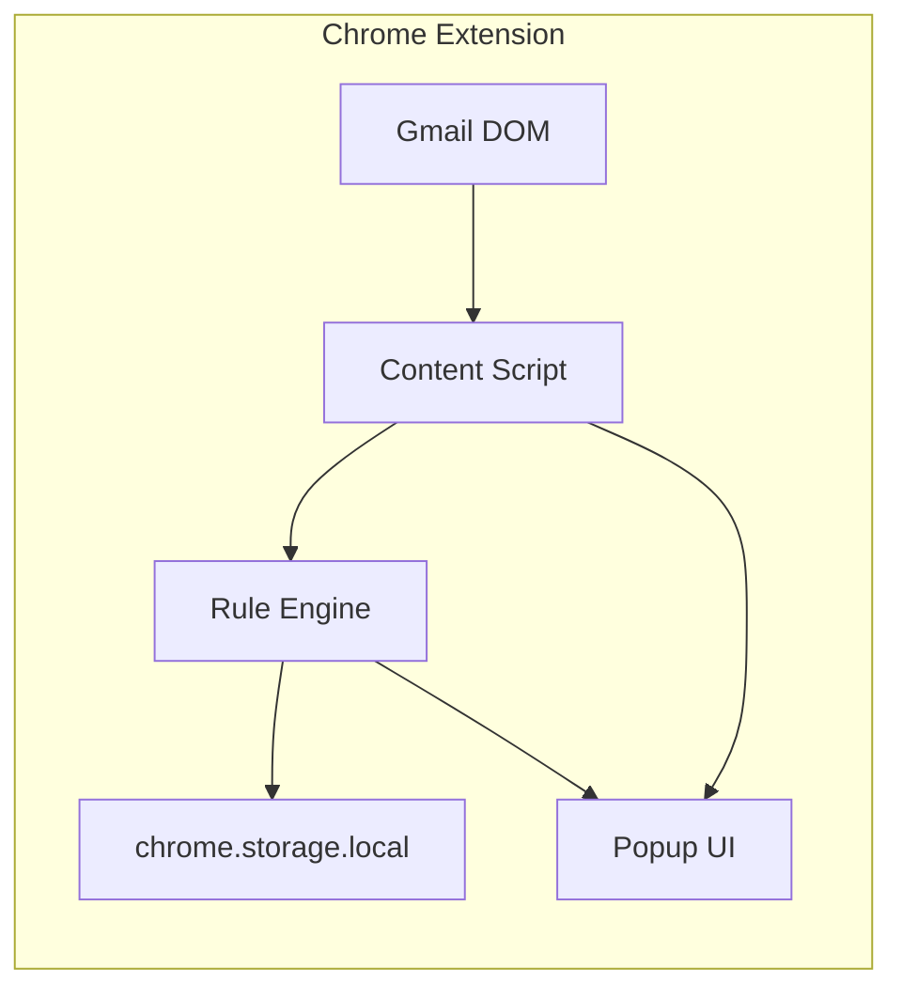

# PhishGuard

[](https://github.com/cyberadithya/phishguard/actions/workflows/ci.yml)

**PhishGuard** is a Chrome extension that analyzes open Gmail messages for phishing indicators using a local, explainable rule engine. All analysis runs in your browser — no email content is sent to external servers.

## Threat model

| Aspect             | Detail                                                                                                                     |
| ------------------ | -------------------------------------------------------------------------------------------------------------------------- |
| **Threat**         | Phishing emails that trick users into clicking malicious links, revealing credentials, or replying to impersonated senders |
| **User**           | College students and general Gmail users reviewing suspicious messages                                                     |
| **Trust boundary** | Email content is read from the Gmail DOM only when the user has the message open                                           |
| **Out of scope**   | Attachment malware analysis, server-side ML, non-Gmail clients (Outlook support planned)                                   |

Full STRIDE threat model for the extension: [docs/THREAT_MODEL.md](docs/THREAT_MODEL.md).

## Features

- **10 heuristic detection rules** — sender mismatch, reply-to divergence, link deception, punycode domains, suspicious TLDs, urgency language, and more
- **Explainable risk score (0–100)** with per-finding evidence
- **Actionable guidance** — what to do when a message looks suspicious
- **Privacy-first** — message analysis is 100% local; the only outbound request is the
  opt-in Safe Browsing URL check described below, which is off by default and never sends
  sender, subject, or body text
- **Badge indicator** — risk score shown on the extension icon while viewing Gmail
- **In-page warning banner** — high-risk alerts displayed directly in Gmail
- **IT export report** — copy Markdown or download JSON for security teams
- **Configurable settings** — adjustable threshold, per-rule toggles, banner on/off
- **Optional threat intel (opt-in)** — check link URLs against Google Safe Browsing using your own API key; off by default, sends URLs only

## Screenshots

| Low risk (benign email)                              | Critical risk (phishing indicators)                    |
| ---------------------------------------------------- | ------------------------------------------------------ |
|  |  |

To capture live PNG screenshots from the actual popup UI, open [`docs/screenshots.html`](docs/screenshots.html) in Chrome.

## Architecture


```mermaid
flowchart LR
  subgraph browser [Chrome Extension]
    Gmail[Gmail DOM]
    ContentScript[Content Script]
    Scorer[Rule Engine]
    Popup[Popup UI]
    Storage[chrome.storage.local]
  end
  Gmail --> ContentScript
  ContentScript --> Scorer
  Scorer --> Storage
  Scorer --> Popup
  ContentScript --> Popup
```

### Detection rules

Each entry below is the rule's exact name in the code (`RULE_DEFINITIONS` in
`src/shared/settings.ts`). `npm run check:docs` fails the build if this list and the code
ever drift apart.

1. **Sender Mismatch** — display name references a brand that does not match the From address
2. **Reply-To Divergence** — Reply-To address differs from the From address
3. **Link Deception** — a link's display text shows one URL but the href points elsewhere
4. **Homograph Domain** — punycode domain that may visually impersonate a real site
5. **Suspicious TLD** — top-level domain commonly abused in phishing (.xyz, .tk, .click, etc.)
6. **Urgency Language** — pressure or credential-related language
7. **Credential Harvesting Link** — login or verification path on an untrusted domain
8. **Sender/Link Domain Mismatch** — links point outside the sender's organization
9. **Wire Transfer Fraud** — urgent payment request patterns common in BEC scams
10. **IP Address Link** — link points to a raw IP address instead of a domain

## Getting started

### Prerequisites

- Node.js 20.19+ (the lint toolchain's floor)
- Google Chrome

### Install and build

```bash
npm install
npm run build
```

### Load in Chrome

1. Open `chrome://extensions`
2. Enable **Developer mode**
3. Click **Load unpacked**
4. Select the `dist/` folder
5. Open [Gmail](https://mail.google.com) and click an email
6. Click the PhishGuard extension icon to view the analysis

### Run tests

```bash
npm test
npm run evaluate   # print precision/recall on the test corpus
```

The test suite includes 20 phishing and 20 benign samples in `tests/fixtures/`, including hard benign cases (Amazon payment updates, marketing urgency, university IT notices) to stress-test false positives.

### Quality checks

These are the same checks CI runs, in the same order:

```bash
npm run lint          # ESLint + typescript-eslint over src/, tests/, scripts/
npm run format:check  # Prettier (use `npm run format` to rewrite in place)
npm run typecheck     # tsc --noEmit
npm run check:docs    # README's rule list vs. RULE_DEFINITIONS
npm run test:coverage # full suite, with coverage thresholds enforced
npm run build         # esbuild bundle into dist/
```

Neither `npm test` nor `npm run build` type-checks — Vitest and the build both transpile
via esbuild, which strips types without checking them — so `npm run typecheck` is what
actually catches type errors.

### Test coverage

Measured with `npm run test:coverage` (v8 provider), not estimated:

| Scope                                                                   | Line coverage |
| ----------------------------------------------------------------------- | ------------- |
| `src/analysis/**` — rule engine, scorer, link parser, report, URL intel | 97.06%        |
| Whole `src/` tree                                                       | 53.79%        |

The whole-tree number is deliberately reported as-is rather than massaged. It is low
because the content script, background service worker, popup and options page only run
inside a Chrome extension context and cannot be imported under Vitest, so they sit at 0%.
The code that the 40-sample corpus and the unit tests actually exercise — the rule engine
— is the number worth reading. Both figures are enforced as thresholds in
`vitest.config.ts` so they can only go up.

## Evaluation results

On the included labeled test corpus (threshold: score ≥ 50 = phishing):

| Metric    | Value                       |
| --------- | --------------------------- |
| Samples   | 40 (20 phishing, 20 benign) |
| Precision | 100%                        |
| Recall    | 100%                        |
| F1        | 100%                        |
| Accuracy  | 100%                        |

**Confusion matrix**

|                 | Predicted phishing | Predicted benign |
| --------------- | ------------------ | ---------------- |
| Actual phishing | 20 TP              | 0 FN             |
| Actual benign   | 0 FP               | 20 TN            |

See [docs/EVALUATION.md](docs/EVALUATION.md) for scoring methodology, rule weights, and limitations.

_Synthetic samples are designed for rule validation and regression testing, not real-world production accuracy._

## Project structure

```
src/
  analysis/       # Rule engine, link parser, scorer, guidance, URL intel
  content/        # Gmail DOM extraction + in-page banner (content script)
  background/     # Service worker (badge updates, Safe Browsing fetch)
  options/        # Extension options page
  popup/          # Extension popup UI
  shared/         # Types, messaging, settings and rule definitions
tests/
  fixtures/       # Labeled phishing and benign email samples
scripts/
  build.mjs           # esbuild bundle
  generate-icons.mjs  # icon generation
  check-docs-sync.ts  # fails CI if README drifts from RULE_DEFINITIONS
```

## Limitations

- **Gmail only** — DOM selectors may break if Google updates the Gmail UI
- **Heuristic-based** — no machine learning; sophisticated spear-phishing may evade rules
- **False positives** — marketing emails with urgency language may score medium risk
- **English-focused** — keyword rules target English phishing templates
- **No attachment scanning** — malicious PDFs/ZIPs are not analyzed
- **Threat intel is opt-in and URL-only** — Safe Browsing checks are off by default and
  send only link URLs when enabled; VirusTotal is not integrated yet

## Ethical use

- Analyze only **your own email** or **synthetic test samples**
- Do not store or transmit other users' email content
- Use findings to educate and protect — not to harass senders
- Report real phishing to your IT team or [PhishTank](https://phishtank.org/)

See [SECURITY.md](SECURITY.md) for privacy details.

## Settings

Open **Extension options** (right-click the PhishGuard icon → Options) or use the **Settings** link in the popup to:

- Adjust the phishing alert threshold (25–75)
- Toggle the in-page Gmail warning banner
- Enable or disable individual detection rules
- Turn on optional Google Safe Browsing URL checks and set your own API key (see below)

### Threat intelligence (optional)

PhishGuard can optionally check the URLs found in an open email against
[Google Safe Browsing](https://developers.google.com/safe-browsing/v4/get-started)'s
threat lists. This is **off by default**. If you turn it on:

- Only the URLs from the open email are sent — never sender, subject, or body text
- You supply your own free Safe Browsing API key, stored locally in `chrome.storage.local`
- The extension requests the `safebrowsing.googleapis.com` host permission only when you enable the feature
- A confirmed match adds a high-weight finding on top of the local heuristic score

See [docs/THREAT_MODEL.md](docs/THREAT_MODEL.md#7-planned-features--threat-preview) for the threat-model update that came with this feature.

## Roadmap

### Recently shipped

- [x] User-configurable sensitivity threshold
- [x] Export analysis report for IT submission
- [x] STRIDE threat model (`docs/THREAT_MODEL.md`)
- [x] 40-sample labeled evaluation corpus with precision/recall/F1 reporting
- [x] MIT `LICENSE` file, and detection-rule copy corrected to match the code (10 rules, not 12)
- [x] Optional Google Safe Browsing URL checks (opt-in, user-supplied API key,
      URL-only, runtime-requested `optional_host_permissions` — see
      [Threat intelligence (optional)](#threat-intelligence-optional) above)
- [x] Popup findings list rendered with `textContent` instead of `innerHTML`,
      closing a residual XSS-hygiene gap the threat model had flagged (E2)
- [x] In-page banner dismissal now persists across refreshes, and is keyed by
      Gmail's real message id when available instead of a content-derived
      heuristic key
- [x] Engineering hygiene: ESLint + Prettier, a real `tsc --noEmit` step (nothing
      type-checked in CI before — both Vitest and the build transpile via esbuild),
      and v8 coverage reporting with measured, enforced thresholds
- [x] `npm run check:docs` — fails the build if README's detection-rule list or
      rule count drifts from `RULE_DEFINITIONS`, so the "12 rules vs. 10" mistake
      cannot recur silently

### Planned

- [ ] **Outlook Web App support** — a second content script targeting
      `outlook.office.com` / `outlook.live.com`, reusing the existing local
      rule engine and scorer unchanged. Needs its own DOM selector module
      (mirroring `gmail-selectors.ts`) since Outlook's markup differs from
      Gmail's, plus a new, minimal host permission scoped to those origins
      only. Tracked as a new-DOM/new-permission entry in
      [docs/THREAT_MODEL.md §7](docs/THREAT_MODEL.md#7-planned-features--threat-preview).
- [ ] **VirusTotal URL enrichment** — a second opt-in threat-intel source
      alongside Safe Browsing, following the same pattern (opt-in, URL-only,
      user-supplied key, runtime-requested permission).
- [ ] **Evaluation honesty upgrade** — tag corpus samples by difficulty
      (obvious/subtle), add intentionally-missed subtle spear-phishing
      samples with documented false negatives, and report recall per tier
      instead of a single 100% figure. See
      [docs/EVALUATION.md § Future evaluation work](docs/EVALUATION.md#future-evaluation-work).
- [ ] Reconcile `enableUrlIntel` against the actual granted
      `chrome.permissions` state on options-page load, so a setting that
      says "on" without the permission having been granted doesn't fail
      silently.
- [ ] Chrome Web Store listing (optional; guide kept locally, not in this repo)
- [ ] Demo video and live PNG popup screenshots (SVG mockups are the
      placeholder for now)
- [ ] Email authentication signals (SPF/DKIM/DMARC) if Gmail ever exposes
      them in the DOM
- [ ] Homograph detection beyond punycode (Unicode confusables)

## License

MIT
