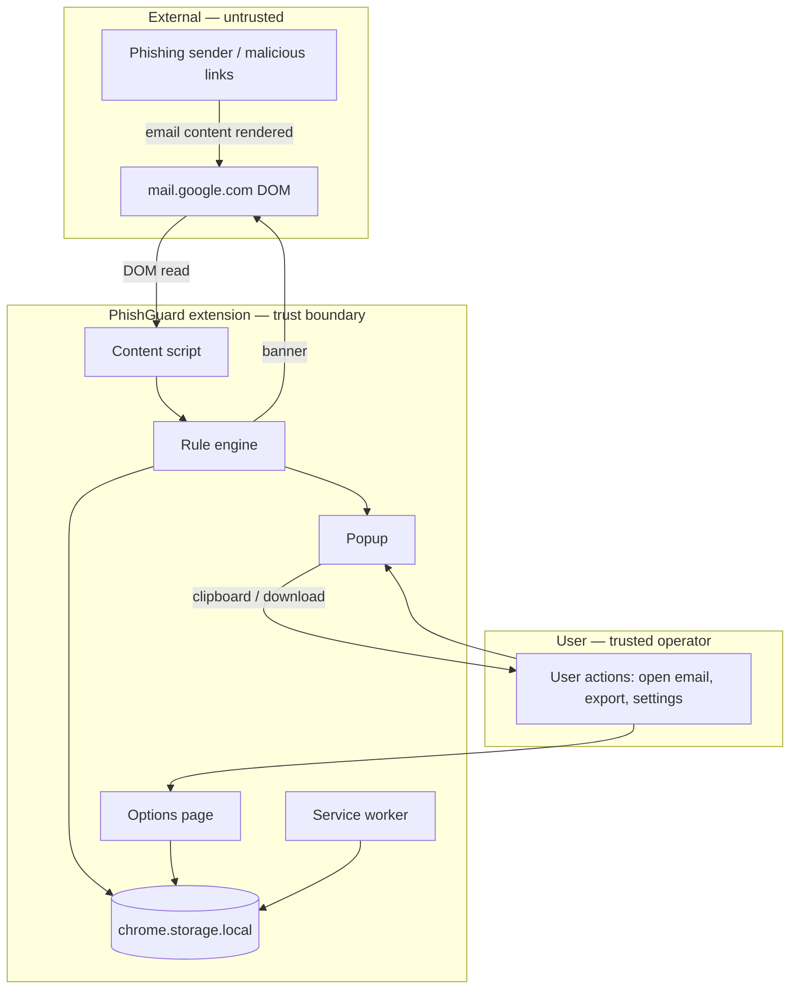

# PhishGuard STRIDE Threat Model

This document applies the [STRIDE](https://learn.microsoft.com/en-us/azure/security/develop/threat-modeling-tool-threats) methodology to **PhishGuard itself** — the Chrome extension, its data flows, and its trust boundaries. It complements the user-facing threat description in the [README](../README.md) (phishing emails targeting Gmail users).

## 1. Scope

### In scope

| Component | Description |
|-----------|-------------|
| Content script | Reads open Gmail message DOM, injects warning banner |
| Rule engine | Local heuristic analysis and scoring |
| Popup UI | Displays findings, guidance, export actions |
| Options page | Threshold, banner toggle, per-rule settings |
| Background worker | Extension badge updates |
| `chrome.storage.local` | Cached analysis, settings, last email metadata |
| Exported reports | Markdown (clipboard) and JSON (download) |

### Out of scope

- Gmail/Google infrastructure security
- Phishing attacks against users who do **not** have PhishGuard installed
- Attachment malware analysis
- Email authentication headers (SPF/DKIM/DMARC) not exposed in the Gmail DOM
- Threat intelligence APIs (planned; not in current MVP)
- Chrome Web Store distribution pipeline (covered at a high level only)

### Assumptions

1. The user installs PhishGuard from a trusted source (local build or verified Chrome Web Store listing).
2. The user's Chrome browser and OS are not already compromised at the kernel/driver level.
3. Gmail's DOM reflects what Google rendered for the signed-in user; PhishGuard does not verify mail transport integrity.
4. Analysis is advisory — users may ignore warnings or dismiss banners.

---

## 2. System context

### Trust boundaries

| Boundary | Crosses with | Data exchanged |
|----------|----------------|--------------|
| Gmail DOM → Content script | Untrusted email content → extension | Subject, sender, body text, link URLs |
| Extension → User | Analysis results, exports | Scores, findings, reports |
| Extension → Local storage | Persistence | Settings, last analysis cache |
| Extension → Network | **None in MVP** | No outbound requests |

---

## 3. Assets

| Asset | Sensitivity | Location |
|-------|-------------|----------|
| Open email content | High (PII, credentials in body) | Gmail DOM (transient), `chrome.storage.local` (cached) |
| Analysis results | Medium | Storage, popup, in-page banner |
| User settings | Low | `chrome.storage.local` |
| Exported reports | High if shared | Clipboard, downloaded files |
| Extension integrity | High | `dist/` bundle, Chrome extension ID |

---

## 4. STRIDE analysis

### 4.1 Spoofing (pretending to be something or someone)

| Threat | Description | Mitigation | Residual risk |
|--------|-------------|------------|---------------|
| **S1 — Malicious email spoofs trusted sender** | Attacker forges display name or From address; user trusts the message. | Rule engine checks sender mismatch, reply-to divergence, link deception, brand/domain alignment. | Sophisticated spear-phishing with compromised legitimate accounts may pass heuristics. |
| **S2 — Attacker spoofs PhishGuard UI** | Malicious page or script imitates the warning banner or popup to show false "safe" or "danger" states. | Banner uses Shadow DOM with extension-only injection; not callable from page scripts. Popup runs in extension origin. | A separate malicious extension could show conflicting UI; user must verify extension identity. |
| **S3 — Typosquat / homograph domains in links** | Links visually mimic trusted brands. | Punycode detection, suspicious TLD checks, deceptive href vs. display text. | Novel homographs without punycode, compromised legit domains not detected by heuristics alone. |

### 4.2 Tampering (modifying data or code)

| Threat | Description | Mitigation | Residual risk |
|--------|-------------|------------|---------------|
| **T1 — DOM tampering before extraction** | Attacker-controlled email HTML alters what the content script reads (if Gmail sanitization fails). | Rely on Gmail's renderer; extract text/attributes only, do not execute email scripts. | Zero-day in Gmail rendering could expose different content to DOM vs. what user sees. |
| **T2 — Tampering with `chrome.storage.local`** | Another extension or local malware modifies cached analysis or settings. | Storage is extension-scoped; other extensions cannot read PhishGuard storage without broader Chrome compromise. | Malware on the host with Chrome profile access could alter extension storage. |
| **T3 — Supply-chain tampering** | Attacker replaces extension package with malicious build. | Install from verified repo or Chrome Web Store; CI builds from source; review `dist/` before loading unpacked. | User loads unreviewed fork; compromised developer machine. |
| **T4 — Exported report tampering** | User or third party edits JSON/Markdown before forwarding to IT. | Reports are point-in-time exports; recipients should treat as user-provided evidence, not signed attestations. | No cryptographic integrity on exports (by design for simplicity). |

### 4.3 Repudiation (denying an action occurred)

| Threat | Description | Mitigation | Residual risk |
|--------|-------------|------------|---------------|
| **R1 — User denies seeing a warning** | User clicks malicious link despite banner/popup, claims no alert shown. | Timestamp in `AnalysisResult.analyzedAt`; export includes generation time. | No server-side audit log; local-only tool cannot prove delivery to user in disputes. |
| **R2 — No central incident record** | Organization cannot correlate PhishGuard alerts across users. | Export workflow lets users share reports with IT; JSON structured for ticketing. | Voluntary export only; no enterprise SIEM integration in MVP. |

### 4.4 Information disclosure (exposing data to unauthorized parties)

| Threat | Description | Mitigation | Residual risk |
|--------|-------------|------------|---------------|
| **I1 — Email content leaked to external servers** | Extension exfiltrates mailbox data. | **No network calls in MVP**; analysis runs in-browser. Permissions limited to `mail.google.com`. | Future Safe Browsing/VirusTotal integration would send **URLs only** (must be opt-in and documented). |
| **I2 — Sensitive data in clipboard/export** | User copies Markdown report containing PII; file saved to shared machine. | Export footer reminds user to redact; IT export is explicit user action. | User may share unredacted reports; clipboard visible to other apps on OS. |
| **I3 — Cached email in local storage** | `lastEmail` / `lastAnalysis` persist on disk. | Data stays in extension-local storage; cleared on extension uninstall. | Forensic access to Chrome profile retrieves cache; shared computers increase exposure. |
| **I4 — Over-broad extension permissions** | Extension reads all sites or all tabs. | Manifest requests `storage`, `activeTab`, and `mail.google.com` host permission only. | `activeTab` still allows popup to message the active Gmail tab when user opens extension. |
| **I5 — Findings reveal internal security posture** | Exported JSON exposes which rules fired, aiding attacker refinement. | Low severity for individual users; enterprise deployments should treat exports as internal. | Targeted attacker learns which heuristics to evade from shared sample reports. |

### 4.5 Denial of service (degrading availability)

| Threat | Description | Mitigation | Residual risk |
|--------|-------------|------------|---------------|
| **D1 — Gmail DOM changes break extraction** | Google updates UI; selectors fail; no analysis shown. | Fallback selectors in `gmail-selectors.ts`; empty state in popup when extraction fails. | Silent failure until selectors updated; user may assume message is safe. |
| **D2 — Mutation observer churn** | Huge DOM mutations slow Gmail tab. | Debounce implicit via `lastEmailKey` deduplication; analyze only when email identity changes. | Very large threads may still trigger frequent observer callbacks before dedup. |
| **D3 — Alert fatigue / banner dismissal** | User dismisses all banners; ignores real threats. | Dismiss is per-email session key; settings allow raising threshold; guidance educates. | Habitual dismissal is a human factors problem, not fully solvable in software. |
| **D4 — False positives block workflow** | Legitimate mail always flagged; user disables extension. | Hard benign corpus in tests; adjustable threshold and per-rule toggles. | Marketing/transactional mail at threshold boundary may still annoy users. |

### 4.6 Elevation of privilege (gaining capabilities without authorization)

| Threat | Description | Mitigation | Residual risk |
|--------|-------------|------------|---------------|
| **E1 — Content script escapes to page origin** | Script gains access to Gmail cookies or session. | Content script isolated world; no `eval` of email HTML; MV3 CSP defaults. | Chrome extension vulnerability class; keep dependencies minimal and updated. |
| **E2 — Malicious email executes in extension context** | Crafted DOM triggers code execution in content script. | No `innerHTML` with email content in extension code; text extraction via `textContent` / attributes. | Future UI changes must avoid injecting unsanitized email HTML into extension pages. |
| **E3 — User misled into disabling protections** | Social engineering convinces user to lower threshold or disable all rules. | Settings require deliberate opt-in; defaults remain conservative (threshold 50). | User can always set threshold to 75 or disable critical rules. |
| **E4 — PhishGuard used as harassment tool** | User exports reports to falsely accuse legitimate senders. | Ethical guidelines in SECURITY.md; reports are heuristic, not legal evidence. | Tool misuse is out of scope for technical controls. |

---

## 5. Component-specific summary

| Component | Primary STRIDE threats | Key controls |
|-----------|------------------------|--------------|
| Content script | S1, T1, I1, E1, E2 | Isolated world, Gmail-only match, no network |
| Rule engine | S1, S3, D4 | Explainable heuristics, tunable rules |
| In-page banner | S2, D3 | Shadow DOM, user dismiss, threshold gating |
| Popup / export | I2, I5, R1 | Explicit export, redaction reminder |
| Options page | T2, E3 | Normalized settings, local storage only |
| Background worker | I1 | Badge only; no email content handling |

---

## 6. Permission justification (security lens)

| Permission | STRIDE relevance | Justification |
|------------|------------------|---------------|
| `storage` | I3, T2 | Cache analysis and settings locally |
| `activeTab` | I4 | Message active Gmail tab when user opens popup |
| `https://mail.google.com/*` | I1, E1 | Inject content script only on Gmail |

**Not requested (deliberately):** `<all_urls>`, `tabs`, `webRequest`, `clipboardRead` — reduces disclosure and tampering surface.

---

## 7. Planned features — threat preview

If roadmap items are implemented, revisit this model:

| Feature | New threats | Required controls |
|---------|-------------|-------------------|
| Google Safe Browsing / VirusTotal | I1 (URL sent externally), I5 | Opt-in only, URL-only submission, API key in storage not in repo, privacy policy update |
| Outlook Web App | T1, D1 (new DOM), I4 (new host permission) | Separate content script, minimal host scope |
| Enterprise policy | T2, R2 | Optional managed storage, signed config |

---

## 8. Residual risk acceptance

PhishGuard is a **defense-in-depth helper**, not a replacement for:

- Gmail's built-in spam/phishing filters
- Email authentication (SPF/DKIM/DMARC) at the mail gateway
- User security awareness training
- Endpoint protection and URL sandboxing

Accepted residual risks for the MVP:

1. Heuristic evasion by targeted attackers
2. No cryptographic signing of analysis exports
3. Local-only storage without enterprise visibility
4. Gmail DOM dependency without automated UI regression tests in production Gmail

---

## 9. Security testing alignment

| Control | Verification |
|---------|--------------|
| Rule coverage | `tests/rules.test.ts`, 40-sample corpus |
| False-positive stress | `benign-011` – `benign-020` fixtures |
| No external calls | Code review; no `fetch` in `src/` (MVP) |
| Permission minimization | `manifest.json` audit |

---

## 10. References

- [PhishGuard README — Threat model](../README.md#threat-model)
- [SECURITY.md](../SECURITY.md)
- [EVALUATION.md](./EVALUATION.md)
- Microsoft STRIDE methodology (linked above)

---

*Last updated for PhishGuard v1.0.0 (MV3, Gmail-only, local analysis MVP).*
